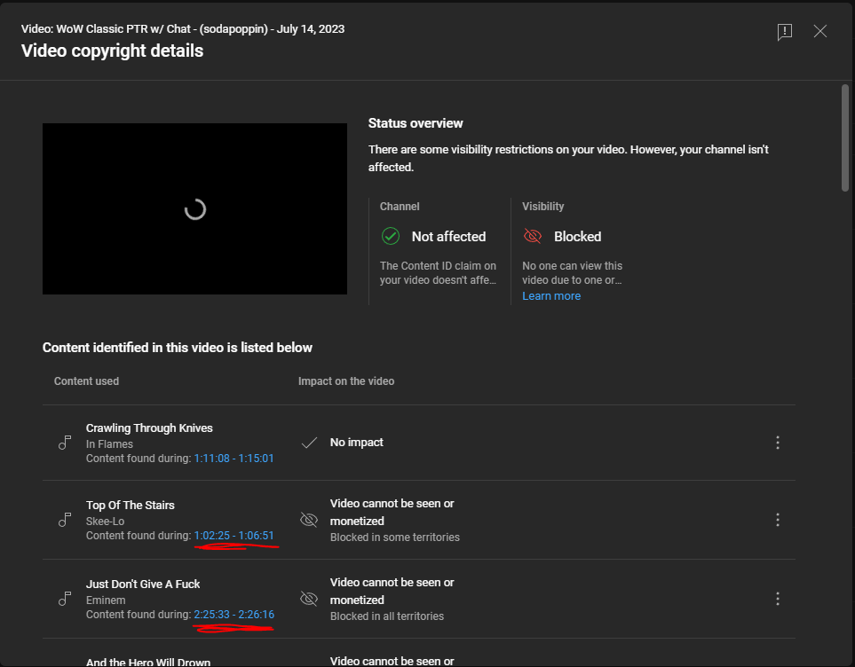
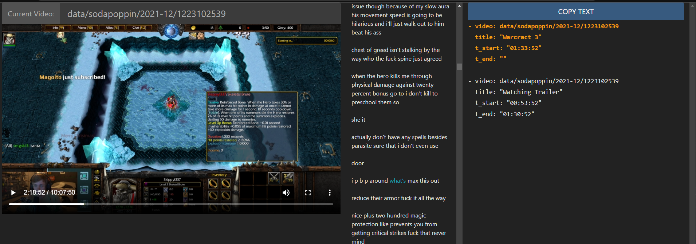

# twitch vod creator

The goal of these scripts is to enable both the automatic downloading and fast quick rough editing of twitch vods for archival on youtube.
At the core we leverage lay295's [TwitchDownload](https://github.com/lay295/TwitchDownloader) utility to download both complete vods, clips, and chats.
For all of these we can render the chat such that the twitch experience is preserved along with the original stream on the video-only youtube platform.
Then we can perform specific "cutting" of downloaded videos to select game playthroughs or segments which others might want to watch.
Both the original vod and chat are then render into the same video which can be uploaded to youtube.
Additionally, a transcript of the video can be generated using [vosk](https://github.com/alphacep/vosk-api) for local use when editing.

Example channels with these video renders:
* Sodapoppin Archives - https://www.youtube.com/channel/UCreuVIdBwFEhf1qFhzyJVKw
* Sevadus Clips - https://www.youtube.com/channel/UCkWuSV5FukUzVLvFnhvPvKQ
* Nmplol Clips - https://www.youtube.com/channel/UCf5sgK1NoQuac1P4P4olelg


### Dependencies & Config

We leverage [python-twitch-client](https://github.com/tsifrer/python-twitch-client) library which recently added oauth support.
You will need at least version 0.7.1 installed to have the correct api support functions.

```bash
pip install python-twitch-client
pip install PyYAML
pip install youtube-video-upload
pip install drivedl
pip install webvtt-py
pip install vosk
```

You will need to make a copy of *[config/auth_example.yaml](config/auth_example.yaml)* and rename it to `config/auth.yaml`.
This should be fill out with a twitch app client information which can be generated from the twitch [developer center](https://dev.twitch.tv/console/apps).
For youtube uploads you will need to generate a oauth json file after you enable Youtube API V3 access in the Google developer console.
Please take a look at the original [youtube-video-upload](https://github.com/remorses/youtube-video-upload) repository for those details if you want to try this.

If you are running this on a linux machine, you will need the ffmpeg binary for your system.
Try to download from the official website as your machine repositories will be too far out of date.
From there, ensure you have Python 3.6 installed, and that you have correct paths to the TwitchDownload CLI and ffmpeg.
See the commented out examples in the top of each script file.
Additionally, one can use the `crontab_script_launcher.sh` script to run script automatically on a cronjob.

```bash
sudo crontab -e
*/25 * * * * /path/to/repo/crontab_script_launcher.sh 0_main_videos.py
*/15 * * * * /path/to/repo/crontab_script_launcher.sh 1_render_segments.py
* */12 * * * /path/to/repo/crontab_script_launcher.sh 0_main_clips.py
```


### Segment Config File Format

The config file format is a yaml file which specifies unique videos which we wish to render of larger vod segments.
A video is defined by the vod which it is cut from and the unique youtube video title which should remain unchanged.
A user can cut multiple segments from a single vod into a video render, but cannot combine multi-vod segments into a single video currently.
The timestamps are specified using `HH:MM:SS` (see ffmpeg docs [here](https://ffmpeg.org/ffmpeg-utils.html#time-duration-syntax)), and are comma separated.

```yaml
- video: sodapoppin/2020-11/804430123
  title:  "Example Video"
  with_chat: false // (option to disable / enable chat)
  description: "This will be in the top of the youtube description" // (optional)
  t_start: "00:00:00,01:00:00"
  t_end: "00:10:00,02:00:00"
  t_youtube_mute: "0:01:00 - 0:02:00,0:10:00 - 0:11:00" // (optional)
  tags: // (optional)
    - "tag 1" // (optional)
    - "tag 2" // (optional)
```

In this example a video of the 804430123 vod will be rendered with the title "Example Video".
The first 10 minutes will be rendered, after which the video will cut to the 1 hour mark, and render the next hour.
Note that while here we can have as long as possible video, youtube has a max upload length of 12 hours.


### Muting Segments

There is some support to mute an already rendered video.
A use case is if Youtube has blocked the video from being shared due to copyrighted music.
One can specify the range that should be muted with the `t_youtube_mute` parameter.



You should be able to directly copy the segments over from the Youtube UI.
In the future this could be extended to use [spleeter](https://github.com/deezer/spleeter).


### Creating Segment Config Files

See the below [website](./website/) directory for a small local interface for generating these files.
Otherwise one can use VLC and [VLC Get Timestamp.ahk](./docs/VLC%20Get%20Timestamp.ahk) autohotkey script.




### Known Issues

* The youtube uploader does not work for me.
After uploading to youtube successfully, after trying to make the video public the video will be blocked due to "terms and conditions violations".
It seems that one now need to approve their account / credentials through the [Audit and Quota Extension Form](https://support.google.com/youtube/contact/yt_api_form?hl=en), if one wishes to make their videos public after upload.

* Ffmpeg rendering still seems to be a bit slow (1.7-2.0x speedup) which I have been unable to increase.
This might be due to the limit of the read speed of my harddrive or tuning of the ffmpeg parameters (which for me do not max out my gpu and cpu).

